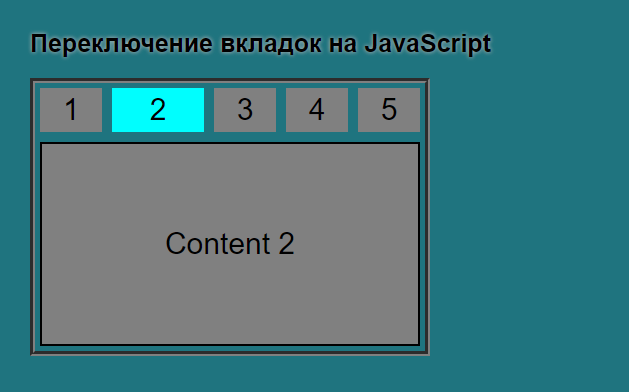

# TEMPLATE
 
# 1 метод 
Алгоритм: 
    1 Устанавливаем active классы вручную на кнопку и на блок-контента 
    2 Скрываем в CSS все блоки контента, кроме активного 
    3 в JS обрабатываем клик по кнопкам 
    4 При клике: 
        - проверяем содержание active класса, что бы избежать лишних вызовов ф-ций 
        - очищаем циклом все active - классы у кнопок и у блок-контента, для этого напишем функцию очистки классов 
        - устанавливаем новый активный класс, для этого напишем функцию установки активного класса 
 
# 2 метод (data атрибуты и init выбранного)
Алгоритм: 
    1 Устанавливаем active классы через JS в функции init 
    2 Скрываем в CSS все блоки контента, кроме активного 
    3 в JS обрабатываем клик по кнопкам 
    4 При клике: 
        - считываем содержимое дата атрибутов 
        - проверяем содержание active класса, что бы избежать лишних вызовов ф-ций 
        - очищаем циклом все active - классы у кнопок и у блок-контента, для этого напишем функцию очистки классов 
        - устанавливаем новый активный класс, для этого напишем функцию установки активного класса 
            

